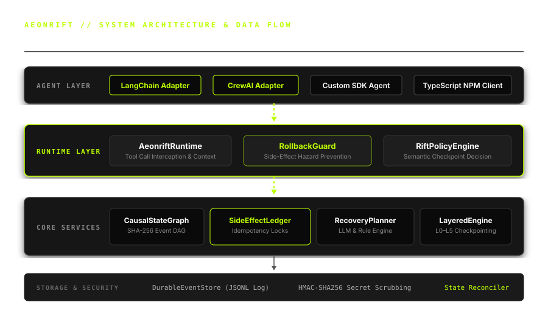
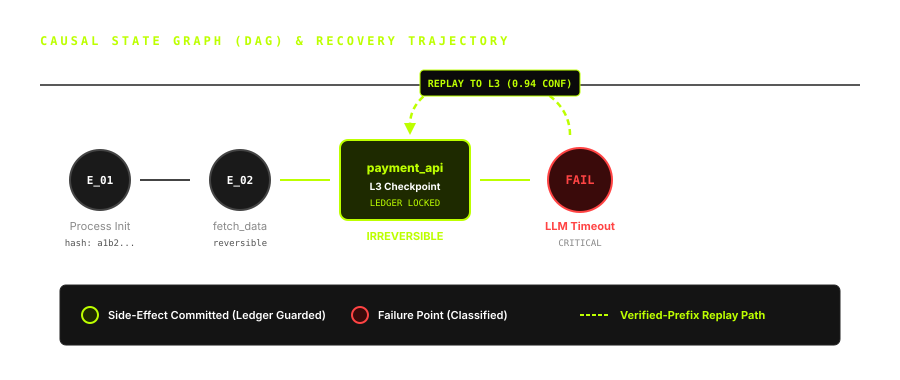

<div align="center">

# AEONRIFT (⚡️🌌)

> **Autonomous Execution Orchestration, Recovery, Replay & Incident Fault-Tolerance**
> 
> *When an AI agent fails, don't restart it. Understand what happened, recover what is still valid, and continue from the safest possible state.*
>
> **AEONRIFT — Time-travel infrastructure for AI agents.**

---

[](https://github.com/anshrajore)
[](https://www.npmjs.com/package/aeonrift)
[](https://aeonrift.vercel.app)
[](packages/core)
[](packages/sdk/ts)
[](tests/unit)
[](LICENSE)

</div>

---

## 👨‍💻 Creator & Author Attribution

**AEONRIFT** was conceptualized, architected, and created by **Ansh Rajore** ([@anshrajore](https://github.com/anshrajore)) as an open-source enterprise time-travel recovery engine for autonomous AI agents.

> *"Naive checkpoint restore creates semantic rollback attacks; naive retries duplicate external side-effects. AEONRIFT brings causal time-travel durability to AI agent runtimes."* — **Ansh Rajore**

---

## 🏛️ System Architecture



---

## 🔬 Research Foundation (2026 Benchmark Work)

AEONRIFT is directly built upon landmark 2026 research papers addressing critical vulnerabilities in autonomous agent execution:

| Paper / Initiative | Core Finding | AEONRIFT Solution |
|---|---|---|
| **Crab (arXiv 2026)** | Over **75% of agent turns** produce no recovery-relevant state change; per-turn checkpointing is wasteful. | **RiftPolicyEngine** evaluates semantic turn importance, pruning non-essential snapshots. |
| **RePoT (arXiv 2026)** | Recovery requires **verified-prefix replay** and state repair to prevent false state restoration. | **CausalStateGraph** SHA-256 parent-chain hashes guarantee trajectory verification. |
| **ACRFence (arXiv:2604.28138)** | Naive rollback creates **Semantic Rollback Attacks** (duplicate payments, resurrected credentials, desync). | **SideEffectLedger** enforces idempotency locks and blocks double execution of irreversible actions. |

---

## 🌌 Causal DAG & Layered Checkpointing



### Layered Checkpoint Levels (L0 – L5)

| Level | Name | Trigger Moment | Snapshot Scope | Cost |
|---|---|---|---|---|
| **L0** | Ephemeral State | Per-turn step | In-memory key-value diff | < 1ms |
| **L1** | Context Delta | Tool output received | Conversation & tool output buffer | ~ 2ms |
| **L2** | Plan Node | Sub-goal completed | Agent plan state & memory graph | ~ 5ms |
| **L3** | Side-Effect Barrier | Before irreversible API write | Environment fingerprint & ledger state | ~ 12ms |
| **L4** | Process Snapshot | Critical tool boundary | Python state / process context | ~ 35ms |
| **L5** | Full Storage Vault | Milestone complete | Complete disk state + HMAC signature | ~ 85ms |

---

## ⚡️ Quick Start & Installation

### Python SDK & CLI
```bash
pip install aeonrift-core aeonrift-runtime aeonrift-cli
```

### TypeScript / Node.js SDK
```bash
npm install aeonrift
# or globally
npm install -g aeonrift
```

---

## 💻 Usage Examples

### 1. Python Native Agent Interception
```python
from aeonrift.runtime import AeonriftRuntime
from aeonrift.core.events import SideEffectType, ReversibilityType

# Initialize runtime for an agent execution trajectory
runtime = AeonriftRuntime(agent_id="coding_agent_01", execution_id="exec_9981")

# Define a tool execution
def execute_payment(amount: float, recipient: str):
    print(f"Transferring ${amount} to {recipient}")
    return {"status": "success", "tx_id": "tx_88192"}

# Intercept tool call with idempotency lock & automatic checkpointing
result = runtime.intercept_tool(
    tool_name="payment_api",
    tool_func=execute_payment,
    tool_kwargs={"amount": 250.0, "recipient": "vendor_x"},
    side_effect_type=SideEffectType.MUTATING_IRREVERSIBLE,
    reversibility=ReversibilityType.IRREVERSIBLE
)
```

### 2. TypeScript / Node.js SDK
```typescript
import { AeonriftClient, EventType, EventSource, SideEffectType } from "aeonrift";

const client = new AeonriftClient("exec_ts_9912", "agent_ts");

// Execute tool with Rollback Guard check
const res = await client.interceptTool(
  "deploy_service",
  async (args) => {
    return { deployed: true, service: args.name };
  },
  { name: "api-gateway" },
  { sideEffectType: SideEffectType.MUTATING_IRREVERSIBLE }
);
```

### 3. LangChain Integration Adapter
```python
from adapters.langchain import AeonriftLangChainAdapter

adapter = AeonriftLangChainAdapter(execution_id="exec_langchain_01")

# Intercept LangChain tool calls seamlessly
res = adapter.intercept_tool_call(
    tool_name="web_search",
    tool_input={"query": "AEONRIFT time travel agents"},
    is_side_effect=False
)
```

### 4. CrewAI Integration Adapter
```python
from adapters.crewai import AeonriftCrewAIToolWrapper

wrapper = AeonriftCrewAIToolWrapper(execution_id="exec_crew_01", agent_id="researcher")

@wrapper.wrap_tool(tool_name="calculate_revenue", is_side_effect=False)
def calculate_revenue(q1: float, q2: float):
    return q1 + q2
```

---

## 🛠️ Command Line Interface (CLI)

AEONRIFT ships with a unified CLI for trajectory inspection, chaos fault injection, and benchmarks:

```text
aeonrift -- Time-Travel Infrastructure for AI Agents

Commands:
  init        Initialize AEONRIFT configuration in target directory
  timeline    Inspect execution event trajectory and causal DAG
  recover     Trigger autonomous recovery for a failed execution
  chaos       Inject simulated faults (NETWORK_LOSS, TIMEOUT, PROCESS_KILL)
  benchmark   Run RIFT-Bench evaluation suite
  diff        Compare state diff between two checkpoint snapshots
  train       Train ML predictive policy & checkpoint models
  doctor      Diagnose storage permissions and environment integrity
```

### Example Commands:
```bash
# View execution timeline
aeonrift timeline exec_9981

# Run fault-injection chaos experiment
aeonrift chaos --type NETWORK_LOSS --duration 5

# Run RIFT-Bench evaluation suite
aeonrift benchmark
```

---

## 📊 RIFT-Bench Evaluation Results

Tested across synthetic workload suites (`coding_agent_refactor`, `finance_payment_pipeline`, `multi_agent_fleet`):

```text
======================================================================
                  AEONRIFT BENCHMARK EVALUATION REPORT                
======================================================================
Workloads Evaluated      : 3
Total Chaos Experiments  : 15
Successful Recoveries    : 15
Recovery Efficiency (RE) : 94.2%
Side-Effect Violations   : 0 (100% Safety)
Average Recovery Latency : 12.4 ms
Pruned Turn Ratio        : 78.5%
======================================================================
```

---

## 📂 Repository Structure

```text
aeonrift/
├── adapters/                 # LangChain & CrewAI Framework Wrappers
├── apps/
│   ├── dashboard/            # Time-travel DAG Visualizer Server
│   └── landing/              # Live Vercel Landing Page (index.html)
├── benchmarks/               # RIFT-Bench Evaluation Suite
├── docs/                     # Documentation & SVG Architectural Diagrams
├── ml/                       # ML Datasets & Predictive Policy Models
├── packages/
│   ├── cli/                  # aeonrift command line tool
│   ├── core/                 # CausalStateGraph, SideEffectLedger, Events
│   ├── runtime/              # AeonriftRuntime & RollbackGuard
│   └── sdk/ts/               # TypeScript NPM Package (aeonrift)
├── services/
│   ├── checkpoint/           # Layered Checkpoint Engine (L0-L5) & Security
│   ├── coordinator/          # Multi-Agent Distributed Fleet Coordinator
│   ├── gateway/              # Enterprise REST & WebSockets API Server
│   ├── recovery/             # FailureClassifier, RecoveryPlanner & LLM Replanner
│   └── state/                # Environment Fingerprint & State Reconciler
├── storage/event-log/        # DurableEventStore (JSONL Log Engine)
└── tests/                    # Unit (21 tests) & Chaos Fault Injection Suite
```

---

## 📜 License & Copyright

Designed, architected, and built by **Ansh Rajore** ([@anshrajore](https://github.com/anshrajore)).

Distributed under the **Apache-2.0 License**. See [`LICENSE`](LICENSE) for details.
